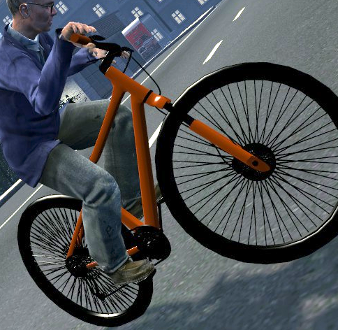

# 🚲 Gmod Bicycle



A bicycle you can actually ride in Garry's Mod. Pedal, lean into corners, bunny hop over things, pull wheelies and
crash spectacularly. The wheels spin, the fork steers and your character keeps their hands on the grips and feet on
the pedals.

## Installing
**Steam Workshop (recommended):** subscribe on the
[Workshop page](https://steamcommunity.com/sharedfiles/filedetails/?id=3810718443) and it will download the next time you
start Garry's Mod.

**Manually:** download this repository and put the contents of this repo in a `bicycle` folder in `garrysmod/addons/`.

## Getting started
1. Open the spawn menu (**Q**), go to **Entities → Fun + Games** and spawn the **Colourable Mountain Bike**. Every
   bike spawns in a random color, and you can repaint it with the Color tool.
2. Walk up to it and press **E** to get on.
3. Hold **W** to pedal and use **A** / **D** to steer.

Knocked the bike over? Press **E** on it and it stands back up when you get on.

## Bicycle Controls
| Key | Action |
|---|---|
| W | Pedal |
| S | Brake. When standing still, walk the bike backwards (doesn't animate walking backwards) |
| A / D | Steer Left/Right |
| Shift | Sprint |
| Space | Bunny hop |
| Right mouse (hold) | Wheelie |
| Ctrl | Switch between first and third person |
| E | Get off |

> [!HINT]
> Hitting something hard enough will throw you over the handlebars.

> [!HINT]
> Water slows you down, and riding in until the bike is half under throws you off. Server admins can change both, or turn
> the throwing off, under **Water** in the server settings.

## Settings
Open the spawn menu and go to **Options → Bicycle**. Changes apply straight away, so you can tweak things while riding.

- **Client** is just for you: camera distance and height, camera roll, speedometer units (km/h, mph or off) and how
  your character sits on the bike. These are saved.
- **Server** changes how every bike on the server rides: top speed, acceleration, steering, grip, suspension and more.
  Only the host or an admin can change these, and they reset to the defaults every time the server restarts.

> [!HINT]
> If you modify any server ConVars and want to automatically persist them in `cfg/server.vdf`: run the command `host_writeconfig_lua` in the server console (or add the relevant ConVars to your `cfg/server.cfg` file)

> [!HINT]
> Changed too much? Run `bicycle_reset_client` in the console to restore your own settings, or `bicycle_reset_tuning`
(admins) to restore the server settings.

## Problems and suggestions
Found a bug, a conflict with another addon, or have an idea? Please
[open an issue](../../issues/new/choose). If something about the handling feels off, the **Tuning feedback** template
is the place for it.

## For modders: adding your own bikes
Other addons can add their own bike models. Each one gets its own entry in the spawn menu. Register it from a shared
`lua/autorun/` file:

```lua
AddCSLuaFile()

hook.Add("BicycleRegisterModels", "myaddon.bike", function()
  bicycle.registerModel("mybike", {
    name = "My Bike",
    model = "models/myname/bicycle.mdl",
    seatOffset = Vector(-8, 0, 1), -- rider position relative to the "seat" attachment
    seatPitch = 50,                -- how far the rider leans forward (deg)
  })
end)
```

- Every setting a model can have is listed in [`lua/bicycle/sh_models.lua`](lua/bicycle/sh_models.lua).
- To line up the rider's seat, hands and feet by eye, ride or look at your bike and run `bicycle_editor` (admins). It
  gives you the matching `bicycle.registerModel` call to copy.
- [📚 `MODELING_GUIDE.md`](MODELING_GUIDE.md) explains how to build a model that works with the addon.
- With `developer 1`, a debug overlay shows the simulated wheels and the model's attachments.

## For gamemode developers: hooks
These hooks let gamemodes and other addons react to bikes. They run on the server, except for the HUD one.

### Getting on and off
`BicycleCanMount` runs when a player presses **E** on a bike. Return `false` to keep them off it:

```lua
--- @param player Player The player trying to get on
--- @param bike Entity The bike
--- @return boolean? Return false to keep the player off the bike
hook.Add("BicycleCanMount", "myaddon.mount", function(player, bike)
end)
```

For example, to keep tied up players off bikes in a [Helix](https://github.com/NebulousCloud/helix) schema:

```lua
hook.Add("BicycleCanMount", "myschema.bicycleRestricted", function(client, bike)
  if (client:IsRestricted()) then
    return false
  end
end)
```

Once a player is on or off the bike, `BicycleRiderMounted` and `BicycleRiderDismounted` run:

```lua
--- @param player Player The rider
--- @param bike Entity The bike
hook.Add("BicycleRiderMounted", "myaddon.mounted", function(player, bike)
end)

--- @param player Player The rider
--- @param bike Entity The bike
--- @param isCrash boolean Whether they were thrown off in a crash, see BicycleRiderCrashed
hook.Add("BicycleRiderDismounted", "myaddon.dismounted", function(player, bike, isCrash)
end)
```

To keep a rider from getting off, use GMod's own `CanExitVehicle` hook. `bicycle.getFromSeat(vehicle)` returns the bike
when the vehicle is a bike's seat:

```lua
hook.Add("CanExitVehicle", "myaddon.stayOnBike", function(vehicle, player)
  if (bicycle.getFromSeat(vehicle)) then
    return false
  end
end)
```

### Crashing
`BicycleShouldCrash` runs when a bike hits something hard enough, tips too far or rides into water that's too deep.
Return `false` to keep the rider on the bike. While the bike stays tipped over or in deep water, this runs every tick,
so keep it cheap:

```lua
--- @param bike Entity The bike
--- @param rider Player The rider
--- @return boolean? Return false to stop the crash
hook.Add("BicycleShouldCrash", "myaddon.noCrash", function(bike, rider)
  if (rider:HasGodMode()) then
    return false
  end
end)
```

When a rider flies over the handlebars, the server runs the `BicycleRiderCrashed` hook once they're off the bike, just
before they're thrown. Return `false` to keep them from being thrown, for example to throw them your own way:

```lua
--- @param player Player The rider that crashed
--- @param bike Entity The bike they crashed with
--- @param velocity Vector The velocity the rider is about to be thrown with
--- @return boolean? Return false to stop the default throw behaviour and handle it yourself
hook.Add("BicycleRiderCrashed", "myaddon.crash", function(player, bike, velocity)
  player:SetVelocity(velocity * 2)

  return false
end)
```

For example, to knock riders out for 10 seconds in a [Helix](https://github.com/NebulousCloud/helix) schema, put this
in a server-side plugin or schema file:

```lua
hook.Add("BicycleRiderCrashed", "myschema.bicycleKnockout", function(client, bike, velocity)
  client:SetRagdolled(true, 10)
end)
```

### HUD
On the client, the speedometer checks GMod's own `HUDShouldDraw` hook with the name `BicycleSpeedometer`, so a gamemode
with its own HUD can hide it:

```lua
hook.Add("HUDShouldDraw", "myaddon.hideBicycleSpeedometer", function(name)
  if (name == "BicycleSpeedometer") then
    return false
  end
end)
```

### Permissions
Admin-only actions are [CAMI](https://github.com/glua/CAMI) privileges, so admin mods like ULX, SAM and Helix can grant
them to any group. Without an admin mod, only admins have them.

| Privilege | Allows |
|---|---|
| `Bicycle - Physgun Ridden Bikes` | Picking up a bike someone is riding with the physgun |
| `Bicycle - Reset Tuning` | Running `bicycle_reset_tuning` |
| `Bicycle - Model Editor` | Using `bicycle_editor` |

## Credits
The bike model is "Bicycle Game Asset" (https://skfb.ly/oyZ6w) by RayznGames is licensed under Creative Commons Attribution (http://creativecommons.org/licenses/by/4.0/)

Changes made to this asset:
- The texture was modified to be gray (instead of orange) to be better recolorable in-game.
- The model was modified (meshes were merged)
- An armature was added to the model to allow it to be animated.
